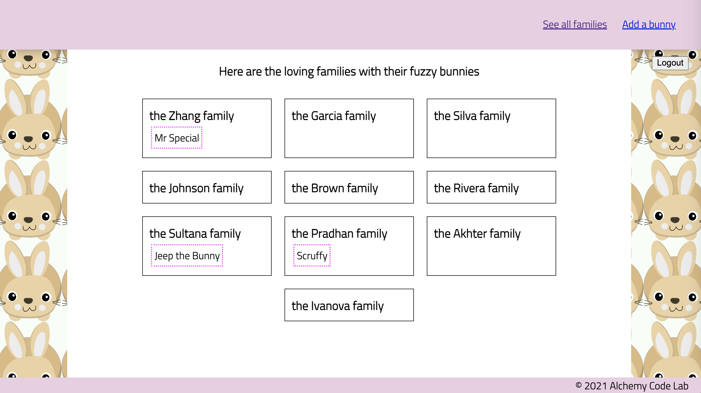

# Supabase Fuzzy Bunny Organizer

## Learning Objectives
- In response to a user event, make a fetch  call to delete an item in the array and display the new state to the user (i.e., delete a todo).

[Buggy Supabase Fuzzy Bunny Organizer](https://github.com/alchemycodelab/buggy-js-fuzzy-bunny-organizer)

### Live Example:
https://alchemycodelab.github.io/js-fuzzy-bunny-organizer/

| User should be able to . . .                                                         |             |
| :----------------------------------------------------------------------------------- | ----------: |
| Visit the deployed pages on GitHub pages, with link in the About section of the Github repo |    1 |

| Events                                                                                |             |
| :----------------------------------------------------------------------------------- | ----------: |
| On the home page (`'/'`), Login and Signup using the login and signup form. On success, redirect to the `/families` page   |        1 |
| Logout by clicking the logout button                                                       |        1 |
| If a non-logged-in user tries to visit the `/families` or `/create` page, redirect them to the login page     |       1 |
| On the `/families` page load, fetch the families (with their bunnies) from supabase and render them to the page         |        1 |
| On clicking a bunny, delete it from supabase. Clear out all families from the DOM, refetch, and render them again.                                              |        1 |
| On the `/create` page, on load, fetch families. Use these families to create the dropdown to let the user attach a bunny to a family.                            |        1 |
| On the `/create` page, on submit, create a bunny. The form should include a name for the bunny and a dropdown for the family (from the fetched families in supabase).                            |        1 |

| Functions                                                                                |             |
| :----------------------------------------------------------------------------------- | ----------: |
| PURE: `renderFamily(family)` : returns a DOM node with family and their bunnies |1|
| PURE: `renderBunny(bunny)` : returns a DOM node the bunny |1|
| ASYNC: `getFamilies()` : get all bunnies in supabase. (These families are the same for everybody in the cohort and do not 'belong' to any particular user. Your bunnies will show up for everybody) |1|
| ASYNC: `createBunny(bunny)` : create bunny in supabase and attach it to a family |1|
| ASYNC: `deleteBunny(id)` : delete a bunny in supabase |1|
